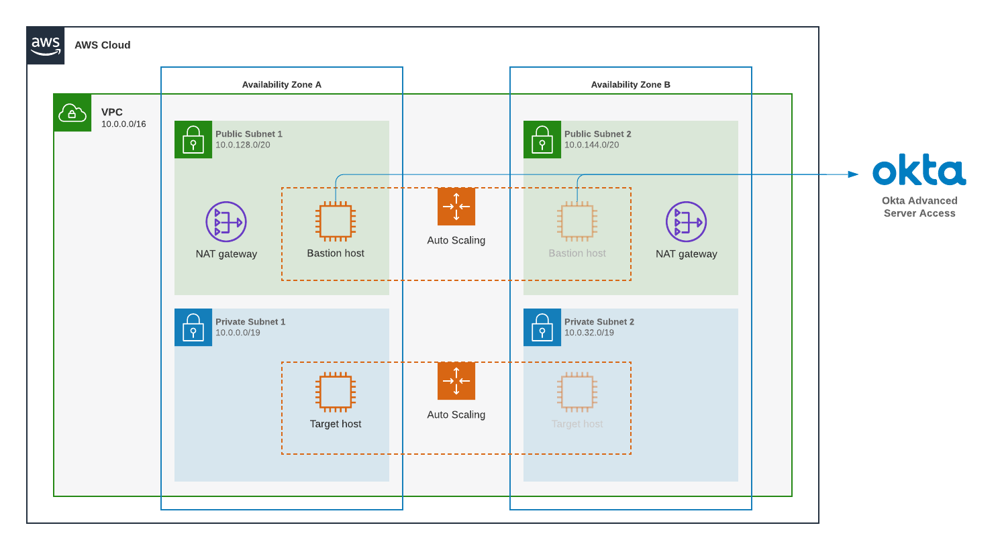

# Okta Advanced Server Access AWS Quick Start

This Quick Start deploys a sample Okta Advanced Server Access Infrastructure to your AWS environment.

It deploys a VPC, Linux bastion hosts, and Linux target hosts. The Okta Advanced Server Access server agent is installed and configured on both Bastion and Target EC2 instances, which delivers a Zero Trust mechanism to authenticate using SSH Client Certificates via an Okta Identity-led authentication workflow.

You can choose to create your Bastion and Target EC2 instances environment with a new VPC environment or deploy into your existing VPC environment.

Deployment instructions:

**Note:** The following instructions require an Okta tenant with Administrative rights. If you do not have an Okta tenant, sign up for a free trial [here](https://www.okta.com/free-trial).

## Create an Advanced Server Access team

- Sign up for Okta Advanced Server Access [here](https://app.scaleft.com/p/signup)
- Follow the workflow to integrate with your Okta Org
- Download the [ASA Client Application](https://help.okta.com/en/prod/Content/Topics/Adv_Server_Access/docs/setup/enrolling-a-client.htm)
- Create a Project and assign a Group that includes users you wish to grant access
- Generate an Enrollment Token (copy this value, you will use it in the CloudFormation template)

## Deploy the CloudFormation template

- Sign up for an [AWS account](https://aws.amazon.com), select a region, and create a key pair for the bastion and target instances.
- In the AWS CloudFormation console, launch one of the following templates to build a new stack:
  - /templates/okta-asa-master.template (to deploy bastion and target hosts with Okta ASA into a new VPC)
  - /templates/okta-asa-bastion.template (to deploy bastion hosts with Okta ASA into your existing VPC)
- In the AWS CloudFormation console, Choose the parameters, and paste the Enrollment Token for the Advanced Server Access project you wish to enroll the instances with
- When deployed, confirm that the instances were properly enrolled by visiting the Advanced Server Access dashboard
- Use the CLI to login to the newly deployed target instance via the bastion by running `sft ssh <target-instance>`

*Optionally, you can configure ProxyCommand for your local SSH to avoid having to preface ssh commands with sft. Run `sft ssh-config` and copy the output to your local SSH configuration*
