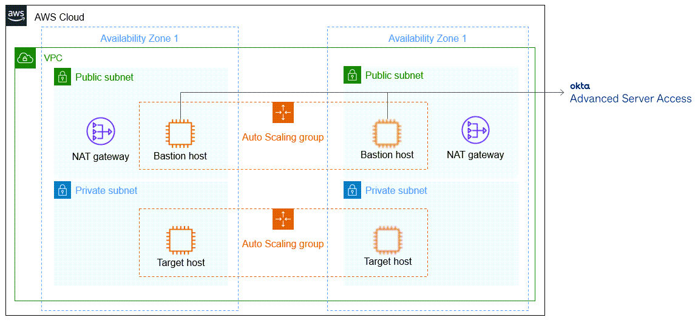

Deploying this Quick Start for a new virtual private cloud (VPC) with default parameters builds the following {partner-product-name} environment in the AWS Cloud.

:xrefstyle: short
[#architecture1]
.Quick Start architecture for _{partner-product-name}_ on AWS
[link=images/okta-asa-architecture_diagram.png]

As shown in <<architecture1>>, the Quick Start deploys the following:

* A highly available architecture that spans two Availability Zones.*
* A VPC configured with public and private subnets, according to AWS best practices, to provide you with your own virtual network on AWS.*

In the public subnets:

* Managed network address translation (NAT) gateways to allow outbound internet access for resources in the private subnets.*
* In the public subnets, a Linux bastion host in an Auto Scaling group to allow inbound Secure Shell (SSH) access to EC2 instances in public and private subnets. The Linux bastion hosts have the Okta Server Agent installed and share a configuration to act as the bastion host for SSH access to the EC2 instances in the public subnet.

In the private subnets, a Linux EC2 instance with the Okta Server Agent installed, configured to only be accessible through the Linux bastion hosts in the public subnets.

[.small]#* The template that deploys the Quick Start into an existing VPC skips the components marked by asterisks and prompts you for your existing VPC configuration.#