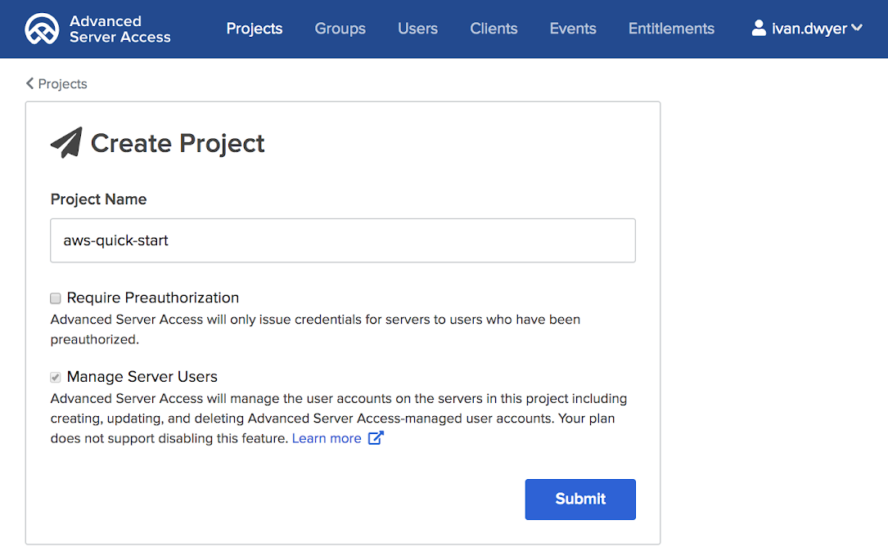

=== Set up {partner-product-short-name}

==== Sign in to your {partner-product-short-name} team

Sign in to your {partner-product-short-name} team at https://app.scaleft.com with your Okta credentials. If you do not have an {partner-product-short-name} team, see link:#_planning_the_deployment[Planning the deployment] earlier in this guide for instructions on how to create a tenant. 

==== Create a project

Create an {partner-product-short-name} project, which represents the authorization scope for a set of EC2 instances. Users and groups are explicitly assigned to projects, where role-based access and entitlements are specified. Okta manages and provisions accounts and entitlements to the downstream EC2 instances.

:xrefstyle: short
[#deploy1]
.Creating a project in {partner-product-name}
[link=images/asa_create_project.png]

==== Configure instance enrollment

In {partner-product-short-name}, EC2 instances are enrolled with a specific project using enrollment tokens or automatic enrollment. This Quick Start supports server enrollment using enrollment tokens.

. Go to the project detail page, and choose the **Enrollment** tab.
. Choose **Create Enrollment Token**.
. Name your token, and choose **Submit**.
. Copy the token value in the next screen for future reference.

=== Confirm your AWS account configuration

. Sign in to your AWS account at https://aws.amazon.com with an IAM user role that has the necessary permissions. For details, see link:#_planning_the_deployment[Planning the deployment] earlier in this guide.
. Make sure that your AWS account is configured correctly, as discussed in the link:#_technical_requirements[Technical requirements] section.

// Optional based on Marketplace listing. Not to be edited
ifdef::marketplace_subscription[]
=== Subscribe to the {partner-product-name} AMI

This Quick Start requires a subscription to the AMI for {partner-product-name} in AWS Marketplace.

. Sign in to your AWS account.
. {marketplace_listing_url}[Open the page for the {partner-product-name} AMI in AWS Marketplace], and then choose *Continue to Subscribe*.
. Review the terms and conditions for software usage, and then choose *Accept Terms*. +
  A confirmation page loads, and an email confirmation is sent to the account owner. For detailed subscription instructions, see the https://aws.amazon.com/marketplace/help/200799470[AWS Marketplace documentation^].

. When the subscription process is complete, exit out of AWS Marketplace without further action. *Do not* provision the software from AWS Marketplace—the Quick Start deploys the AMI for you.
endif::marketplace_subscription[]
// \Not to be edited

=== Launch the Quick Start

WARNING: If you're deploying {partner-product-short-name} into an existing VPC, make sure that your VPC has two private subnets in different Availability Zones for the workload instances and that the subnets aren't shared. This Quick Start doesn't support https://docs.aws.amazon.com/vpc/latest/userguide/vpc-sharing.html[shared subnets^]. These subnets require https://docs.aws.amazon.com/vpc/latest/userguide/vpc-nat-gateway.html[NAT gateways^] in their route tables to allow the instances to download packages and software without exposing them to the internet. Also make sure that the domain name option in the DHCP options is configured as explained in http://docs.aws.amazon.com/AmazonVPC/latest/UserGuide/VPC_DHCP_Options.html[DHCP options sets^]. You provide your VPC settings when you launch the Quick Start.

Each deployment takes about {deployment_time} to complete.

. Sign in to your AWS account, and choose one of the following options to launch the AWS CloudFormation template. For help with choosing an option, see link:#_deployment_options[Deployment options] earlier in this guide.
+
[cols="3,1"]
|===
^|https://fwd.aws/aywQq[Deploy {partner-product-short-name} into a new VPC on AWS^] 
^|https://fwd.aws/my7yy[View template^]
^|https://fwd.aws/G7D46[Deploy {partner-product-short-name} into an existing VPC on AWS^] 
^|https://fwd.aws/bmXMa[View template^]
|===
+
. Check the AWS Region that's displayed in the upper-right corner of the navigation bar, and change it if necessary. This is where the network infrastructure for {partner-product-name} will be built. The template is launched in the {default_deployment_region} Region by default. For other choices, see link:#_supported_regions[Supported Regions] earlier in this guide.
. On the *Create stack* page, keep the default setting for the template URL, and then choose *Next*.
. On the *Specify stack details* page, change the stack name if needed. Review the parameters for the template. Provide values for the parameters that require input. For all other parameters, review the default settings and customize them as necessary.